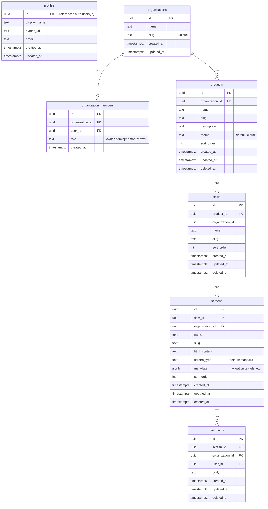

# Convert Validator 3000 into Multi-Product Next.js Wireframing Platform

## Overview

Transform the single-file Allpacko HTML prototype into a standalone Next.js app with an MCP server that supports multiple products, each with their own flows and screens. The app preserves the existing wireframe aesthetic (phone frame, ASCII art, monospace typography) and adds Supabase auth, multi-product management, per-screen comments, real-time updates, and Render.com deployment.

**Primary interaction model**: Designers use **Claude Code** connected to the **MCP server** to create and iterate on products, flows, and screens. Changes appear **immediately** in the browser viewer. The web app is primarily for **viewing** prototypes, **navigating** flows, and **adding review comments**.

## Problem Statement

The current prototype is a single 3,652-line `index.html` with everything hardcoded for one product (Allpacko). It can't:
- Support multiple products
- Persist data across sessions (beyond localStorage)
- Support team collaboration with auth
- Be edited programmatically (no API, no MCP)
- Scale — adding a new product means duplicating the entire file

## Proposed Solution

A three-component system:

1. **Next.js 16 web app** — Prototype viewer with auth, comments, and real-time updates
2. **MCP server** — Claude Code interface for all CRUD operations (products, flows, screens)
3. **Supabase** — PostgreSQL database, auth, RLS, and Realtime subscriptions

Screen content is stored as HTML blobs in Supabase, rendered in a sandboxed iframe within the phone frame. When Claude Code updates a screen via MCP, the browser viewer reflects the change in real-time via Supabase Realtime.

## Technical Approach

### Architecture

```
┌──────────────────────┐      ┌──────────────────────────────┐
│  Claude Code         │      │  Browser (Next.js App)       │
│  (Designer's desk)   │      │                              │
│  ┌────────────────┐  │      │  ┌─────────┐  ┌──────────┐  │
│  │ MCP Client     │  │      │  │ Auth    │  │ Prototype│  │
│  │ (Claude Code   │  │      │  │ (login) │  │ Viewer   │  │
│  │  built-in)     │  │      │  └────┬────┘  └────┬─────┘  │
│  └───────┬────────┘  │      │       │            │         │
└──────────┼───────────┘      │  ┌────┴────────────┴──────┐  │
           │                  │  │ Supabase Client         │  │
           │ MCP Protocol     │  │ + Realtime Subscriptions│  │
           │ (stdio/SSE)      │  └───────────┬────────────┘  │
           │                  └──────────────┼───────────────┘
           │                                 │
     ┌─────┴─────────────────────────────────┴──────┐
     │  MCP Server (Express.js)                      │
     │  ┌──────────────┐  ┌──────────────────────┐  │
     │  │ Tools:       │  │ Supabase Admin Client│  │
     │  │ - products   │  │ (service role)       │  │
     │  │ - flows      │  └──────────┬───────────┘  │
     │  │ - screens    │             │               │
     │  │ - comments   │             │               │
     │  └──────────────┘             │               │
     └───────────────────────────────┼───────────────┘
                                     │
     ┌───────────────────────────────┼───────────────┐
     │  Supabase                                     │
     │  ┌──────────┐  ┌──────────┐  ┌────────────┐  │
     │  │ Auth     │  │ Postgres │  │ Realtime   │  │
     │  │ (PKCE)   │  │ (data)   │  │ (push)     │  │
     │  └──────────┘  └──────────┘  └────────────┘  │
     └───────────────────────────────────────────────┘
```

**Data flow for a screen edit:**
1. Designer tells Claude Code: "Make the auth screen show a Google login button"
2. Claude Code calls MCP tool `update_screen` with new HTML content
3. MCP server writes to Supabase via admin client
4. Supabase Realtime pushes change to all connected browsers
5. Browser viewer re-renders the screen in the phone frame — **instantly**

### Tech Stack (matching Factory)

| Technology | Version | Notes |
|---|---|---|
| Next.js | ^16.1.6 | App Router, proxy.ts (not middleware.ts) |
| React | ^19.0.0 | |
| TypeScript | ^5.7.2 | strict mode |
| @supabase/ssr | ^0.8.0 | PKCE, cookie-based sessions |
| @supabase/supabase-js | ^2.98.0 | Also used in MCP server |
| Tailwind CSS | ^4.2.1 | v4 with @theme directive |
| @modelcontextprotocol/sdk | latest | MCP server SDK |
| ESLint | ^9.39.3 | Flat config (no `next lint`) |
| Vitest | ^4.0.18 | |
| Node.js | >=22 | |

### Data Model



**Key conventions (matching Factory):**
- `organization_id` on every table for multi-tenant RLS
- UUIDs via `gen_random_uuid()`
- `created_at`, `updated_at` (with `touch_updated_at()` trigger)
- Soft deletes via `deleted_at`
- `is_org_member()` RLS function for row-level security
- Defense-in-depth: always scope queries by `organization_id` in app code
- All mutable tables added to `supabase_realtime` publication

### MCP Server Tools

The MCP server exposes these tools for Claude Code:

**Products:**
- `list_products` — List all products in the organization
- `create_product` — Create a new product (name, description, theme)
- `update_product` — Update product settings (name, description, theme)
- `delete_product` — Soft-delete a product

**Flows:**
- `list_flows` — List flows for a product
- `create_flow` — Create a new flow in a product
- `update_flow` — Update flow name or order
- `delete_flow` — Soft-delete a flow (cascades to screens)
- `reorder_flows` — Set sort order for all flows in a product

**Screens:**
- `list_screens` — List screens in a flow
- `get_screen` — Get a screen's full details including HTML content
- `create_screen` — Create a new screen with HTML content
- `update_screen` — Update screen name, HTML content, or metadata
- `delete_screen` — Soft-delete a screen
- `reorder_screens` — Set sort order for all screens in a flow

**Comments:**
- `list_comments` — List comments for a screen
- `add_comment` — Add a comment to a screen
- `delete_comment` — Delete a comment

**Utility:**
- `get_wireframe_styles` — Returns the base wireframe CSS (so Claude Code can author screens with correct styles)
- `get_screen_template` — Returns a blank screen template with the standard wireframe structure

### Folder Structure

```
src/
  app/
    (auth)/
      login/page.tsx                # Google OAuth button
      signup/page.tsx               # Redirects to /login
      auth/callback/route.ts        # Code exchange + profile sync
    onboarding/
      create-workspace/page.tsx     # First-time org creation
    (app)/
      layout.tsx                    # Authenticated layout with product switcher
      products/
        page.tsx                    # Product list / create
        [productSlug]/
          layout.tsx                # Product-level layout
          page.tsx                  # Redirect to first flow
          flows/
            [flowSlug]/
              page.tsx              # Prototype viewer (phone frame + panels)
    api/
      health/route.ts
  components/
    base/                           # Buttons, inputs, etc.
    prototype/
      phone-frame.tsx               # iPhone frame with side buttons
      screen-renderer.tsx           # Sandboxed iframe for screen HTML
      flow-panel.tsx                # Left sidebar: flow navigation
      toc-panel.tsx                 # Left sidebar: table of contents
      comments-panel.tsx            # Right sidebar: comments
      theme-toggle.tsx              # Theme cycle button
    layout/
      app-shell.tsx                 # Top-level layout with nav
      product-switcher.tsx          # Product dropdown/selector
    shared/
  hooks/
    use-prototype-nav.ts            # Screen navigation state
    use-comments.ts                 # Comments CRUD
    use-theme.ts                    # Theme state
    use-realtime-screens.ts         # Supabase Realtime subscription for screen updates
  lib/
    supabase/
      client.ts                     # Browser client
      server.ts                     # Server client
      middleware.ts                 # updateSession() helper
      admin.ts                      # Service role client
      auth.ts                       # getClaimsUser()
      env.ts                        # Env var centralization
    products/                       # Product data access
    flows/                          # Flow data access
    screens/                        # Screen data access
    comments/                       # Comment data access
  providers/
    theme-provider.tsx
    realtime-provider.tsx           # Supabase Realtime connection
  styles/
    globals.css
    theme.css                       # Design tokens
    wireframe.css                   # Wireframe-specific styles (ported from prototype)
  utils/
    cx.ts                           # tailwind-merge wrapper
    get-base-url.ts                 # Reverse proxy URL helper (critical for Render)
  proxy.ts                          # Auth guard (Next.js 16 convention)
mcp-server/
  src/
    index.ts                        # MCP server entry point
    tools/
      products.ts                   # Product CRUD tools
      flows.ts                      # Flow CRUD tools
      screens.ts                    # Screen CRUD tools
      comments.ts                   # Comment tools
      utility.ts                    # get_wireframe_styles, get_screen_template
    lib/
      supabase.ts                   # Supabase admin client for MCP
  package.json                      # Separate package
  tsconfig.json
supabase/
  config.toml
  migrations/
    YYYYMMDDHHMMSS_initial_schema.sql
  seed.sql                          # Allpacko seed data
render.yaml
```

### Screen HTML Rendering Security

Screen HTML is rendered in a sandboxed `<iframe srcDoc>` with two-layer security (matching Factory's artifact rendering pattern):

```tsx
<iframe
  srcDoc={htmlWithBaseStyles}
  sandbox="allow-scripts"
  style={{ width: '100%', height: '100%', border: 'none' }}
/>
```

The `htmlWithBaseStyles` wraps screen content with:
1. Base wireframe CSS (monospace fonts, box-drawing styles, theme colors)
2. CSP meta tag: `<meta http-equiv="Content-Security-Policy" content="default-src 'self' 'unsafe-inline'; script-src 'unsafe-inline';">`

This prevents XSS from screen content escaping the iframe while allowing the wireframe's inline styles and scripts.

### Real-Time Updates

When Claude Code updates a screen via MCP:
1. MCP server writes to Supabase `screens` table
2. Supabase Realtime broadcasts the change on the `screens` channel
3. The browser's `useRealtimeScreens` hook receives the update
4. The phone frame re-renders with the new HTML content

This uses Supabase's built-in Realtime feature — no custom WebSocket server needed.

### Auth Flow (matching Factory exactly)

Factory uses **Google OAuth only** — no email/password. Validator 3000 will use the same approach:

1. **Unauthenticated request** → `proxy.ts` checks for `sb-*-auth-token` cookie
2. **No auth cookie** → redirect to `/login`
3. **Login page** → Google OAuth button triggers `supabase.auth.signInWithOAuth({ provider: "google", options: { queryParams: { prompt: "select_account" } } })`
4. **OAuth redirect** → Google redirects back to `/auth/callback?code=...&next=...`
5. **Code exchange** → `/auth/callback` route exchanges code for session, syncs profile metadata (display_name, avatar_url) to `profiles` table
6. **Session set** → Supabase auth cookies set on the redirect response object
7. **Workspace check** → App layout calls `requireWorkspaceContext()` which resolves active organization from `v3k_workspace` cookie or oldest membership
8. **No membership** → redirect to `/onboarding/create-workspace`
9. **Workspace creation** → User creates first organization (name → slug) and becomes owner
10. **Authenticated** → User sees product list

**Key implementation details from Factory:**
- `proxy.ts` (NOT middleware.ts) with `PUBLIC_ROUTES` array
- `getBaseUrl()` using `x-forwarded-host`/`x-forwarded-proto` (critical for Render)
- Cookie detection: `c.name.startsWith("sb-") && c.name.includes("-auth-token")`
- Auth callback: build redirect Response first, wire Supabase client cookies to that response, then exchange code
- Profile upsert from OAuth metadata (`user_metadata.full_name`, `user_metadata.avatar_url`)
- `requireWorkspaceContext()` cached via React `cache()` — multiple layouts share one DB call
- Workspace cookie: `v3k_workspace` (HttpOnly, 1yr max-age) stores active org UUID
- `/signup` page just redirects to `/login`

**Files to replicate from Factory:**
- `src/proxy.ts` — auth guard
- `src/lib/supabase/` — all 6 files (client, server, middleware, admin, auth, env)
- `src/app/login/page.tsx` — Google OAuth login
- `src/app/signup/page.tsx` — redirect to login
- `src/app/auth/callback/route.ts` — code exchange + profile sync
- `src/lib/workspace.ts` — organization resolution + cookie management
- `src/app/onboarding/create-workspace/page.tsx` — first-time org creation
- `src/components/layout/auth-shell.tsx` — shared auth page layout

### MCP OAuth Infrastructure

For the MCP server, Factory uses database-backed OAuth 2.0 with dedicated tables:

- `mcp_oauth_clients` — Dynamic client registration
- `mcp_auth_codes` — Short-lived authorization codes with PKCE
- `mcp_oauth_sessions` — User sessions mapping to Supabase tokens
- `mcp_refresh_tokens` — Rotated refresh tokens
- `cleanup_mcp_oauth_state()` — Lifecycle management function

This allows MCP clients (Claude Code) to authenticate with per-user identity so Supabase RLS policies apply. The service role key stays on the server — never distributed to clients.

**Pattern to follow:** `/Users/danielmccool/Repos/Seizo/factory/supabase/migrations/20260227153555_mcp_oauth_infrastructure.sql`

## Scope Boundaries (NOT in v1)

- Visual drag-and-drop screen editor in the browser
- AI-assisted screen generation (Claude Code IS the AI assistant)
- Factory integration API
- Real-time collaboration cursors
- Mobile-responsive layout for the app itself
- Organization management UI beyond initial creation
- Comment threading, resolution, or notifications
- Screen version history

## Implementation Phases

### Phase 1: Foundation (scaffolding + Google OAuth + workspace onboarding + deploy)

**Goal**: Next.js 16 app with Google OAuth, workspace creation, deployed to Render.com

**Files**: Project root config, `src/proxy.ts`, `src/lib/supabase/*`, `src/lib/workspace.ts`, `src/app/(auth)/*`, `src/app/onboarding/*`, `src/components/layout/auth-shell.tsx`, `render.yaml`, `supabase/migrations/*`, `supabase/config.toml`

**Tasks**:
- [ ] Initialize Next.js 16 project with TypeScript, Tailwind v4, ESLint flat config
- [ ] Set up Supabase project with Google OAuth enabled in config.toml
- [ ] Create 6-file Supabase client pattern (client.ts, server.ts, middleware.ts, admin.ts, auth.ts, env.ts) — copy from Factory
- [ ] Create `getBaseUrl()` helper using `x-forwarded-host`/`x-forwarded-proto` (critical for Render)
- [ ] Create `proxy.ts` auth guard with PUBLIC_ROUTES, cookie detection via `includes("-auth-token")`
- [ ] Create initial Supabase migration: profiles, organizations, organization_members (with RLS)
- [ ] Build `AuthShell` component (shared auth page layout)
- [ ] Build login page with Google OAuth button (`prompt: "select_account"`)
- [ ] Build signup page (redirect to login)
- [ ] Build auth callback route: exchange code → sync profile metadata (display_name, avatar_url) → set cookies on redirect response → validate `next` param (starts with `/`, not `//`)
- [ ] Build `workspace.ts` — resolveActiveOrganization(), requireWorkspaceContext() with React cache(), workspace cookie (`v3k_workspace`)
- [ ] Build onboarding: create-workspace page (name → slug, auto-create owner membership)
- [ ] Set up `render.yaml` with `runtime: node`, `preDeployCommand` for migrations
- [ ] Configure Google OAuth credentials (GOOGLE_CLIENT_ID, SUPABASE_AUTH_EXTERNAL_GOOGLE_CLIENT_SECRET)
- [ ] Deploy to Render.com and verify full auth flow: login → Google → callback → workspace creation → protected page

**Execution note**: Replicate Factory's auth exactly. Key files to reference and adapt: proxy.ts, all 6 supabase/ files, auth/callback/route.ts, workspace.ts, login/page.tsx, onboarding/create-workspace/page.tsx, auth-shell.tsx. Key pitfalls: proxy.ts not middleware.ts, getBaseUrl() for reverse proxy, cookies wired to redirect response object (not shared server client), includes() not endsWith() for cookie detection, prompt=select_account for Google OAuth.

**Patterns to follow**:
- `/Users/danielmccool/Repos/Seizo/factory/src/proxy.ts`
- `/Users/danielmccool/Repos/Seizo/factory/src/lib/supabase/*` (all 6 files)
- `/Users/danielmccool/Repos/Seizo/factory/src/lib/workspace.ts`
- `/Users/danielmccool/Repos/Seizo/factory/src/app/login/page.tsx`
- `/Users/danielmccool/Repos/Seizo/factory/src/app/auth/callback/route.ts`
- `/Users/danielmccool/Repos/Seizo/factory/src/app/onboarding/create-workspace/page.tsx`
- `/Users/danielmccool/Repos/Seizo/factory/src/components/layout/auth-shell.tsx`

**Verification**: Can log in via Google, create a workspace, and see a protected page on the Render deployment. Unauthenticated requests redirect to /login. Auth works both locally and on Render.

---

### Phase 2: Data Model + Migrations

**Goal**: Supabase tables with RLS and Realtime enabled

**Files**: `supabase/migrations/*`, `src/lib/products/*`, `src/lib/flows/*`, `src/lib/screens/*`, `src/lib/comments/*`

**Tasks**:
- [ ] Create migration: products table (id, organization_id, name, slug, description, theme, sort_order, timestamps, deleted_at)
- [ ] Create migration: flows table (id, product_id, organization_id, name, slug, sort_order, timestamps, deleted_at)
- [ ] Create migration: screens table (id, flow_id, organization_id, name, slug, html_content, screen_type, metadata, sort_order, timestamps, deleted_at)
- [ ] Create migration: comments table (id, screen_id, organization_id, user_id, body, timestamps, deleted_at)
- [ ] Set up RLS policies using `is_org_member()` pattern
- [ ] Add `touch_updated_at()` triggers on all tables
- [ ] Add all tables to `supabase_realtime` publication
- [ ] Create server-side data access functions for products, flows, screens, comments
- [ ] Add slug generation (kebab-case from name, unique within parent)

**Execution note**: Every mutation must include `.eq("organization_id", ...)` even with RLS. Soft deletes — filter with `.is("deleted_at", null)`.

**Patterns to follow**: `/Users/danielmccool/Repos/Seizo/factory/supabase/migrations/20260218183340_initial_schema.sql`

**Verification**: Can create a product with flows and screens via Supabase dashboard. RLS blocks cross-org access. Tables appear in Realtime publication.

---

### Phase 3: MCP Server

**Goal**: A working MCP server that Claude Code can connect to for full CRUD on products, flows, and screens

**Files**: `mcp-server/src/*`

**Tasks**:
- [ ] Initialize MCP server package with `@modelcontextprotocol/sdk`
- [ ] Set up Supabase admin client (service role key) within MCP server
- [ ] Implement product tools: `list_products`, `create_product`, `update_product`, `delete_product`
- [ ] Implement flow tools: `list_flows`, `create_flow`, `update_flow`, `delete_flow`, `reorder_flows`
- [ ] Implement screen tools: `list_screens`, `get_screen`, `create_screen`, `update_screen`, `delete_screen`, `reorder_screens`
- [ ] Implement comment tools: `list_comments`, `add_comment`, `delete_comment`
- [ ] Implement utility tools: `get_wireframe_styles`, `get_screen_template`
- [ ] Add organization scoping to all tools (API key → org lookup)
- [ ] Test all tools via Claude Code locally
- [ ] Document MCP server setup in README (how to add to Claude Code config)

**Execution note**: Use Factory's MCP OAuth infrastructure — database-backed OAuth 2.0 with per-user identity so RLS applies. Create the MCP OAuth migration (mcp_oauth_clients, mcp_auth_codes, mcp_oauth_sessions, mcp_refresh_tokens) matching Factory's pattern. The MCP server runs locally via stdio transport, connecting to the remote Supabase. Never distribute the service role key to clients.

**Patterns to follow**:
- `/Users/danielmccool/Repos/Seizo/factory/mcp-server/src/`
- `/Users/danielmccool/Repos/Seizo/factory/supabase/migrations/20260227153555_mcp_oauth_infrastructure.sql`

**Verification**: From Claude Code, can create a product, add flows, add screens with HTML content, and verify the data appears in Supabase.

---

### Phase 4: Prototype Viewer (the core experience)

**Goal**: Phone frame with screen rendering, flow panel, TOC panel, real-time updates

**Files**: `src/components/prototype/*`, `src/app/(app)/products/[productSlug]/flows/[flowSlug]/page.tsx`, `src/hooks/*`, `src/styles/wireframe.css`

**Tasks**:
- [ ] Port wireframe CSS from `index.html` into `wireframe.css` (phone frame, buttons, screen styles, all theme variants)
- [ ] Build `PhoneFrame` component (iPhone outline with side buttons, inner screen area)
- [ ] Build `ScreenRenderer` component (sandboxed iframe with srcDoc, inject wireframe base styles)
- [ ] Build `FlowPanel` component (left sidebar showing all flows for this product, click to navigate)
- [ ] Build `TocPanel` component (screens in current flow, with name + comment count)
- [ ] Build `usePrototypeNav` hook (active screen, goTo next/prev, keyboard Enter to advance)
- [ ] Build `useRealtimeScreens` hook (Supabase Realtime subscription — when screen HTML changes, re-render)
- [ ] Build the prototype viewer page composing all panels + phone frame
- [ ] Support keyboard navigation (Enter to advance, Escape to go back)
- [ ] Handle empty states (product with no flows, flow with no screens)
- [ ] Support deep linking via URL: `/products/:slug/flows/:flowSlug?screen=:screenSlug`

**Execution note**: The phone frame and wireframe aesthetic are the soul of this product. Port styles carefully from the existing prototype. The screen HTML is rendered in a sandboxed iframe — inject base wireframe styles (fonts, colors, box-drawing classes) into the iframe so screens can use them without carrying their own `<style>` blocks. Real-time updates are critical — when Claude Code edits a screen via MCP, the viewer must update within seconds.

**Patterns to follow**: Current `index.html` for all CSS and phone frame markup. Factory's artifact sandbox pattern for iframe rendering.

**Verification**: Can view a product's flows and navigate between screens in the phone frame. When a screen is updated via MCP/Supabase, the viewer reflects the change without page reload.

---

### Phase 5: Comments System

**Goal**: Per-screen comments panel with add/view, backed by Supabase

**Files**: `src/components/prototype/comments-panel.tsx`, `src/hooks/use-comments.ts`, `src/lib/comments/*`

**Tasks**:
- [ ] Build `CommentsPanel` component (right sidebar: comment list, input textarea, submit button)
- [ ] Build `useComments` hook (fetch comments for active screen, submit new comment, delete own comments)
- [ ] Show comment counts on TOC items (badge with count)
- [ ] Show commenter name (from Supabase auth profile) and timestamp
- [ ] Auto-scroll to latest comment on submit
- [ ] Wire comments to current screen (refresh when screen changes)
- [ ] Ctrl+Enter / Cmd+Enter to submit

**Verification**: Can add comments on a screen, see them persist across page reloads, see comment count badges on TOC.

---

### Phase 6: Theme System + Product Switcher

**Goal**: 7 themes, product switching, polished chrome

**Files**: `src/providers/theme-provider.tsx`, `src/hooks/use-theme.ts`, `src/components/prototype/theme-toggle.tsx`, `src/components/layout/product-switcher.tsx`

**Tasks**:
- [ ] Port all 7 theme variants from the prototype CSS (cloud, sky, sage, lavender, sand, rose, dark)
- [ ] Build `ThemeProvider` — default theme comes from product setting, user can override locally
- [ ] Build `ThemeToggle` button (cycles through themes)
- [ ] Apply theme to phone frame, panels, and page background
- [ ] Build product switcher dropdown in nav bar (list products, link to each)
- [ ] Build product list page (card grid with create button)
- [ ] Build create product form (name, description — can also be done via MCP)

**Verification**: Can cycle through all 7 themes. Theme persists across refreshes. Can switch between products from the nav bar.

---

### Phase 7: Seed Data (Allpacko import)

**Goal**: Import the existing Allpacko prototype as the first product via MCP or seed script

**Files**: `supabase/seed.sql` or `scripts/import-allpacko.ts`

**Tasks**:
- [ ] Extract all 48 Allpacko screens from `index.html` into individual HTML snippets
- [ ] Create seed script that inserts: 1 product (Allpacko), 5 flows (new, invited, bundle, trip, packing), 48 screens with HTML content
- [ ] Map the existing TOC structure to flow → screen relationships with correct sort_order
- [ ] Preserve screen navigation metadata (goTo targets) in screen metadata JSON
- [ ] Verify the imported prototype looks identical to the original in the new viewer

**Execution note**: This is the acceptance test for the entire platform. If Allpacko renders correctly in the new system with all 48 screens navigable, everything works. Consider creating this as an MCP-driven script so it also validates the MCP tools.

**Verification**: Navigate through the full Allpacko prototype in the new app. Every screen renders correctly. Flow panel and TOC match the original.

---

## Deferred to Implementation

1. **MCP auth mechanism**: Use Factory's OAuth infrastructure from day 1 (mcp_oauth_clients, mcp_auth_codes, mcp_oauth_sessions, mcp_refresh_tokens).
2. **Screen navigation metadata format**: How to encode "this button goes to screen X" in the metadata JSON. Define during Phase 4 implementation.
3. **Base wireframe styles injection**: Exactly which CSS gets injected into every screen's iframe. Extract from prototype during Phase 4.
4. **Organization creation flow**: Auto-create on signup for v1.
5. **MCP transport**: stdio for local dev. Consider SSE/HTTP for remote access later.
6. **Concurrent edit handling**: Last-write-wins for v1 (small team). Add `updated_at` conflict detection later.

## Requirements Trace

| Requirement | Phase | Verification |
|---|---|---|
| Multi-product support | 2, 6 | Create 2+ products, switch between them |
| Screen/flow management via MCP | 3 | Claude Code CRUD on products, flows, screens |
| Phone frame renderer | 4 | Allpacko screens render identically to original |
| Real-time updates | 4 | MCP edit → viewer updates without reload |
| Flow panel navigation | 4 | Click flow → navigate to first screen |
| TOC panel navigation | 4 | Click TOC item → navigate to screen |
| Per-screen comments | 5 | Add comment, see it persist, see count badge |
| Theme system | 6 | All 7 themes work, persist per user |
| Auth (Google OAuth) | 1 | Google login → workspace creation → protected app |
| Allpacko seed data | 7 | Full 48-screen prototype imported correctly |
| Render.com deploy | 1 | Push to main → live update |
| Deep linking | 4 | URL routes to specific product/flow/screen |
| MCP wireframe authoring | 3 | Create screen with HTML via Claude Code |

## Success Metrics

- **Functional**: All 48 Allpacko screens render identically to the original prototype
- **Real-time**: Screen edit via MCP → visible in browser < 3 seconds
- **MCP workflow**: Designer can create a new product with 5 flows and 10 screens entirely from Claude Code in < 10 minutes
- **Collaboration**: Team members can log in, view prototypes, and leave comments
- **Deploy**: Push to main → live on Render in < 5 minutes

## Dependencies & Prerequisites

- Supabase project created with auth + Realtime enabled
- Render.com account with auto-deploy from GitHub
- GitHub repo (current: `kkkkkkkkkk9/validator3000-allpacko`)
- Environment variables: `NEXT_PUBLIC_SUPABASE_URL`, `NEXT_PUBLIC_SUPABASE_PUBLISHABLE_KEY`, `SUPABASE_SERVICE_ROLE_KEY`
- `@modelcontextprotocol/sdk` for MCP server

## Risk Analysis & Mitigation

| Risk | Impact | Mitigation |
|---|---|---|
| Screen HTML XSS | High | Sandboxed iframe with CSP meta tag (two-layer) |
| Auth broken on Render | High | getBaseUrl() helper from day 1, test on Render early |
| proxy.ts convention miss | High | Use proxy.ts not middleware.ts (Next.js 16 lesson) |
| MCP server reliability | High | Test all tools end-to-end before moving to Phase 4 |
| Supabase Realtime latency | Medium | Test with real MCP edits; fallback to polling if needed |
| Large screen HTML blobs | Medium | Postgres text columns handle it; monitor query perf |
| Theme CSS complexity | Low | Port directly from working prototype; test all 7 |

## Institutional Learnings Applied

These documented lessons from the Factory project are directly applicable:

1. **Next.js 16 uses `proxy.ts`** — not `middleware.ts` (silently ignored)
2. **`request.url` unreliable on Render** — must use `x-forwarded-host`/`x-forwarded-proto`
3. **Auth cookies on redirect response** — wire cookies to the response object in `/auth/callback`
4. **Cookie detection** — use `includes("-auth-token")` not `endsWith()`
5. **`render.yaml`** — not `render.blueprint.yaml`, use `runtime: node` not docker
6. **Pre-deploy migrations** — `preDeployCommand` in render.yaml
7. **Organization scoping** — `.eq("organization_id", ...)` on all mutations
8. **Sandboxed iframe rendering** — for user-generated HTML content
9. **`useSearchParams()` needs Suspense** — or prefer server component `searchParams` prop
10. **ESLint flat config** — Next.js 16 removed `next lint`
11. **RSC boundary** — keep shared utils out of `"use client"` files
12. **Redirect validation** — starts with `/`, not `//`
13. **MCP service role key** — never distribute to clients; MCP server runs locally with its own key
14. **MCP stale sessions** — return 404 for unknown sessions to trigger re-init

## Sources & References

### Internal References
- Current prototype: `/Users/danielmccool/Repos/Seizo/workflow/index.html`
- Factory conventions: `/Users/danielmccool/Repos/Seizo/factory/CLAUDE.md`
- Factory Supabase setup: `/Users/danielmccool/Repos/Seizo/factory/src/lib/supabase/`
- Factory schema: `/Users/danielmccool/Repos/Seizo/factory/supabase/migrations/20260218183340_initial_schema.sql`
- Factory proxy: `/Users/danielmccool/Repos/Seizo/factory/src/proxy.ts`
- Factory MCP server: `/Users/danielmccool/Repos/Seizo/factory/mcp-server/src/`
- Factory render config: `/Users/danielmccool/Repos/Seizo/factory/render.yaml`

### Learnings Applied
- Auth patterns: `/Users/danielmccool/Repos/Seizo/factory/docs/solutions/runtime-errors/reverse-proxy-redirect-url-resolution.md`
- Render config: `/Users/danielmccool/Repos/Seizo/factory/docs/solutions/integration-issues/render-config-filename-convention.md`
- Iframe sandboxing: `/Users/danielmccool/Repos/Seizo/factory/docs/solutions/feature-implementations/ai-artifacts-sandboxed-rendering-and-version-history.md`
- MCP security: `/Users/danielmccool/Repos/Seizo/factory/docs/solutions/security-issues/mcp-service-role-key-exposure-rls-bypass.md`
- MCP sessions: `/Users/danielmccool/Repos/Seizo/factory/docs/solutions/integration-issues/mcp-stale-session-id-blocks-ios-desktop-reconnection.md`
